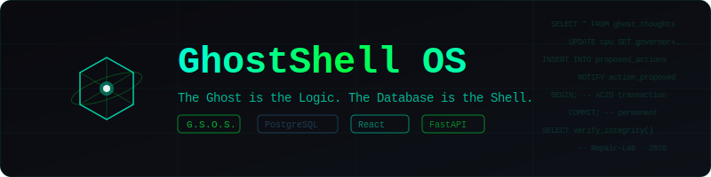

<p align="center">
  
</p>

<h1 align="center">🧠 GhostShell OS (G.S.O.S.)</h1>

<p align="center">
  <em>「Ghost は論理。データベースは殻。」</em>
</p>

<p align="center">
  <a href="../README.md">English</a> ·
  <a href="README_de.md">Deutsch</a> ·
  <a href="README_tr.md">Türkçe</a> ·
  <a href="README_zh.md">中文</a> ·
  <a href="README_ja.md"><strong>日本語</strong></a> ·
  <a href="README_ko.md">한국어</a> ·
  <a href="README_es.md">Español</a> ·
  <a href="README_fr.md">Français</a> ·
  <a href="README_ru.md">Русский</a> ·
  <a href="README_pt.md">Português</a> ·
  <a href="README_ar.md">العربية</a> ·
  <a href="README_hi.md">हिन्दी</a>
</p>

---

## 🌊 GhostShell とは？

**GhostShell はリレーショナル AI オペレーティングシステムです。** OpenClaw のようなプロジェクトがシステムの*上で*動作するのに対し、GhostShell はシステム**そのもの**です。PostgreSQL データベースを、ハードウェアドライバ、ファイルシステム、AI モデル（「ゴースト」）が SQL テーブルを通じて通信する生きた有機体に変えます。

すべての思考。すべてのファイル移動。すべてのハードウェア信号。それら全てが — ACID 準拠のデータベーストランザクション。破壊不能。安全。一貫性。

```
┌─────────────────────────────────────────────────────────┐
│            🖥️  サイバーデッキ（React インターフェース）      │
│     デスクトップ · アプリ · ゴーストチャット · ストア       │
│          WebSocket 駆動 · リアルタイム                    │
└────────────────────────┬────────────────────────────────┘
                         │
┌────────────────────────▼────────────────────────────────┐
│            ⚡ ニューラルブリッジ（FastAPI）                 │
│     デュアルプールアーキテクチャ：System + Runtime         │
│   REST API · WebSocket · コマンドホワイトリスト           │
└────────────────────────┬────────────────────────────────┘
                         │
┌────────────────────────▼────────────────────────────────┐
│          🧠 殻（PostgreSQL 16 + pgvector）                │
│                                                         │
│   9 スキーマ · 100+ テーブル · 行レベルセキュリティ       │
│   スキーマフィンガープリント · 不変性保護                  │
└─────────────────────────────────────────────────────────┘
```

---

## 🔥 なぜ OpenClaw ではなく GhostShell なのか？

| | OpenClaw | GhostShell OS |
|---|---|---|
| **アーキテクチャ** | システム上のアプリケーション | システム**そのもの** |
| **データ永続性** | 揮発性メモリ | ACID トランザクション — すべての思考が永続的 |
| **ハードウェア** | 外部 API | テーブルとしてのハードウェア — `UPDATE cpu SET governor='performance'` |
| **AI モデル** | 単一モデル、再起動が必要 | ホットスワップゴースト — コンテキストを失わずに LLM を変更 |
| **セキュリティ** | アプリケーションレベル | 3層の不変性：コア → ランタイム → ゴースト |
| **映像/センサー** | ファイルベース | 統合テーブルビュー — データベース内でリアルタイム |
| **自己修復** | 手動 | 人間の承認付き自律修復パイプライン |

---

## 🛠 アーキテクチャ

| レイヤー | 技術 | 目的 |
|---|---|---|
| **カーネル** | PostgreSQL 16 + pgvector | リレーショナルコア — 9 スキーマ、100+ テーブル |
| **知能** | ローカル LLM（vLLM, llama.cpp） | ゴーストの意識 — 思考、決定、行動 |
| **ニューラルブリッジ** | FastAPI（Python） | UI とカーネル間のデュアルプールセキュリティ層 |
| **センサー** | Python ハードウェアバインディング | CPU、GPU、VRAM、温度、ネットワーク — すべてテーブルとして |
| **インターフェース** | React サイバーデッキ | WebSocket 駆動のウィンドウ、アプリ、タスクバー |
| **整合性** | スキーマフィンガープリント + RLS | 176 個の監視対象、不変のコア保護 |

---

## 🔒 3 つのセキュリティレイヤー

```
   ┌───────────────────────────────────────────┐
   │   不変コア（dbai_system）                   │  ← スキーマ所有者、完全制御
   │   スキーマフィンガープリント、ブート設定     │
   ├───────────────────────────────────────────┤
   │   ランタイム層（dbai_runtime）              │  ← Web サーバー運用
   │   RLS 強制、ポリシーによる読み書き          │
   ├───────────────────────────────────────────┤
   │   ゴースト層（dbai_llm）                    │  ← AI は提案のみ可能
   │   proposed_actions への INSERT のみ        │
   │   ALTER、DROP、CREATE は不可               │
   └───────────────────────────────────────────┘
```

**ゴーストは修復できる — ただし再構築はできない。** 提案された変更はすべて以下のプロセスを経ます：

```
ゴーストが提案 → 人間が承認 → SECURITY DEFINER が実行 → 監査ログに記録
```

---

## 🚀 クイックスタート：「殻に接続せよ」

```bash
# 1. 殻をクローン
git clone https://github.com/Repair-Lab/claw-in-the-shell.git
cd claw-in-the-shell

# 2. マトリックスを初期化
psql -U postgres -c "CREATE DATABASE dbai;"
for f in schema/*.sql; do psql -U dbai_system -d dbai -f "$f"; done

# 3. ゴーストを起動
export DBAI_DB_USER=dbai_system
export DBAI_DB_PASSWORD=<パスワード>
export DBAI_DB_HOST=127.0.0.1
export DBAI_DB_NAME=dbai
export DBAI_DB_RUNTIME_USER=dbai_runtime
export DBAI_DB_RUNTIME_PASSWORD=<パスワード>
python3 -m uvicorn web.server:app --host 0.0.0.0 --port 3000

# 4. デッキに入る
cd frontend && npm install && npx vite --host 0.0.0.0 --port 5173
# → http://localhost:5173 を開く
```

---

## 🦾 機能

- [x] **テーブルとしてのハードウェア** — ファン、CPU クロック、ドライブを `SQL UPDATE` で制御
- [x] **17 のデスクトップアプリ** — ゴーストチャット、ソフトウェアストア、LLM マネージャーなど
- [x] **ホットスワップゴースト** — コンテキストを失わずにランタイムで LLM を変更
- [x] **不変性保護** — 176 のスキーマフィンガープリント、違反ログ
- [x] **修復パイプライン** — ゴースト提案 → 人間承認 → 安全な実行
- [x] **WebSocket コマンドホワイトリスト** — すべてのWS コマンドをデータベースで検証
- [x] **OpenClaw ブリッジ** — OpenClaw スキルをより安全な環境にインポート
- [x] **リアルタイムメトリクス** — CPU、RAM、GPU、温度を WebSocket でストリーミング
- [x] **ナレッジベース** — pgvector によるベクトル駆動のシステムメモリ
- [x] **行レベルセキュリティ** — 5 つのデータベースロールにわたる 71 の RLS ポリシー付きテーブル
- [ ] **自律コーディング** *（進行中）* — ゴーストが自身の SQL マイグレーションを作成
- [ ] **ビジョン統合** *（計画中）* — `media_metadata` でのリアルタイムビデオ分析
- [ ] **分散ゴースト** *（計画中）* — ノード間の複数ゴーストインスタンス

---

## 🎨 ブランディング

| 要素 | 値 |
|---|---|
| **コードネーム** | Claw in the Shell |
| **システム名** | GhostShell OS (G.S.O.S.) |
| **哲学** | *「Ghost は論理。データベースは殻。」* |
| **カラー** | Deep Space Black `#0a0a0f` · サイバーシアン `#00ffcc` · マトリクスグリーン `#00ff41` |
| **ロゴコンセプト** | 幽霊のようなコアを持つ輝くデータキューブ |

---

<p align="center">
  <strong>GhostShell OS</strong> — すべての思考がトランザクションになる場所。<br/>
  <em>Repair-Lab · 2026</em>
</p>
